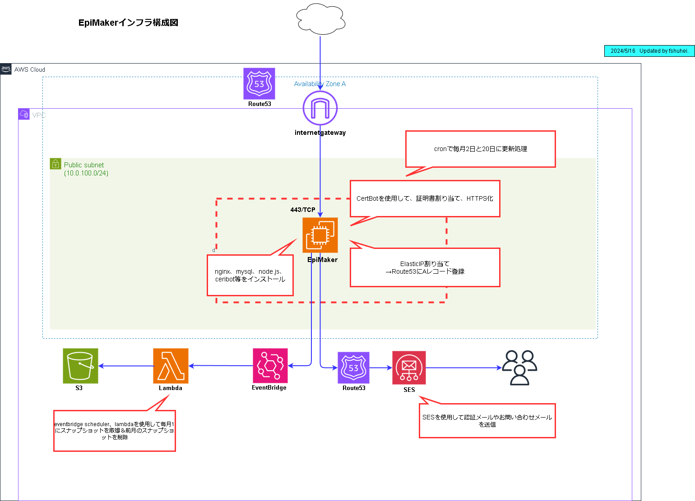

# Epimaker

## Overview
#### このサイトはエピソードをAIで作成できるサイトです。
#### サイトURL→https://epimaker.com
 

### ・みんなの投稿画面サンプル

   

### ・新規作成画面サンプル

 

## Requirement
### ・laravel 10
### ・php 8.2.9
### ・nginx 1.22.1
### ・Composer version 2.7.6
### ・npm 8.11.0
### ・node v17.9.1
### ・mysql Ver 8.4.0
 

## Infrastructure
#### 下記構成図のように、AWS環境に本番デプロイしています。

#### ・EC2インスタンスはAmazon Linux2 AMIを使用
#### ・ボリュームはgp2を使用
#### ・インスタンスタイプは開発時はt3.small、本番稼働時はt3.microを使用
#### ・CertBotの証明書を使用
#### ・メール送信はSESとRoute53を使用
#### ・週次バックアップにEventBridgeとLambdaを使用
#### ・カスタムドメイン取得とDNSにRoute53を使用
 

## Author
#### f.shuhei
